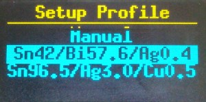
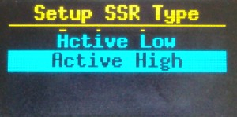

# Firmware for a DIY Reflow Hot-Plate like "[Tim's Hot Plate](https://www.instructables.com/Tims-Hot-Plate/)"

A feature-rich reflow Hot-Plate firmware, i.e. usable for "[Tim's Hot Plate](https://www.instructables.com/Tims-Hot-Plate/)"

## Introduction

I was in the need for a reflow soldering Hot-Plate.

After evaluating a couple of good projects, I decided to build "[Tim's Hot Plate](https://www.instructables.com/Tims-Hot-Plate/)" as it had a very detailed and quite good description, as well as I like the way how he did it with less or minimal external parts.

It was quickly build up and it worked quite good so that I could do my reflow soldering project for which I needed the Hot-Plate.

But: I decided for a larger (and more powerfull) 400W PTC as well as I mounted the Thermocouple in a different way as Tim did/described in his description.
The result was, that I had to struggle with quite large overshooting (up to +40°C).
Not a big deal as it was fairly easiable to compensate this overshooting by choosing a smaller target temp before reaching the real target temp. 

However, during the reflow of a coulpe of prototype PCB's, the overshooting workaround started to annoy me, as well as I got a couple of ideas (while rotating the knob and watching/waiting for the target temperature).

As we all have some kind of fetish, and mine seem to be that I tend to over-optimize things others are fine with, I decided trying to build a more feature-rich firmware alternative.

## Features

- Built-in "Setup" within Hot-Plate user interface

    

- "Manual" or (open-end) "Reflow-Profile" Mode, with built-in reflow profiles for low-temp. solder paste Sn42/Bi57.6/Ag0.4, as well as high-temp. Sn96.5/Ag3.0/Cu0. After (as well as during) the reflow profile time targets, the user may adapt the target temp. (every 10 seconds). At profile end, the last target temp remain active and the user has to stop the profile manually when everything reflowed correctly.

    
    

- PID constant settings (within built-in setup)

    
    
    

- BangON/BangOFF (quick start) settings and functionality. Mainly for bad/non-configuraed PID controller constants (a good configured PID controller normally does not need BangON/BangOFF, but PID controller constant determination is complicated and time consuming)

    
    

- SSR type (active-low/high) configurable within buit-in setup

    

- Save of settings to EEPROM possible within built-in setup 

    

## Requirements

Assembled DIY Hot Plate like described in "[Tim's Hot Plate](https://www.instructables.com/Tims-Hot-Plate/)" which is based on the following components

- ATmega328 like Arduino Nano 3.x
- Some kind of cheap AC-Mains powered PTC heater (200-400W)
- SSR (active- high or low) which has enough power to switch your selected PTC
- Convenient K-Type Thermocouple
- MAX6675 Module
- SSD1306 0.96" I2C OLED 128x64 Display
- Rotary EC11 Encoder

## Roadmap

- [ ] Step response output for easier PID constant determination by the help of [PID Tuner](https://pidtuner.com)
- [ ] Some kind of PID loop tuning/calibration
- [ ] Ramp-up determination to identify PTC time and TC delay (BangON calibration)
- [ ] Progressive rotary switching for quicker +/- move
- [ ] C/F unit selection (if someone is interested in)
- [ ] Larger display so that I don't need my glasses (old man wish)

## Known Bugs/Issues

- I've the impression that the Ki constant of the (currently) used [AutoPID](https://r-downing.github.io/AutoPID/) doesn't behave as expected. Will revalidate later ...

## Technology

The code structure is [PlatformIO/VSCode](https://platformio.org/) based (no Ardino-IDE test or support).

## Installing

1. Upload .hex or .elf file WITHOUT HAVING AC-MAINS CONNECTED
2. Long-press (> 0.5s) to get into built-in setup
3. Choose "SSR Type"
4. Select your SSR type (Active-Low/High). In the case  of [Tim's Hot Plate](https://www.instructables.com/Tims-Hot-Plate/) it will be "Active-Low"
5. Choose "Save & Quit"
6. Plug-in AC-Mains. Happy reflow soldering...

## Usage

- Rotate knob for +/- or up/down
- Push knob to stop (or start profile if it's displayed on screen)
- Long-Push (> 0.5s) to get into built-in setup

## Built With

* [Tim's Hot Plate](https://www.instructables.com/Tims-Hot-Plate/) - Quite cool DIY reflow Hot Plate Project @ Instructables
* [U8g2](https://github.com/olikraus/u8g2) - Excellent and powerful Library for monochrome displays, version 2
* [MAX6675](https://github.com/adafruit/MAX6675-library) - Arduino library for interfacing with MAX6675 thermocouple amplifier
* [CRC32](https://github.com/bakercp/CRC32) - An Arduino library for calculating a CRC32 checksum
* [AutoPID](https://github.com/r-downing/AutoPID) - Fairly good documented (as well as feature rich and small) Arduino AutoPID library 

## Contributing

Please read [CONTRIBUTING.md](./CONTRIBUTING.md) for details on our code of conduct, and the process for submitting pull requests to us.

## Versioning

<!-- FIXME -->

We use [SemVer](http://semver.org/) for versioning. For the versions available, see the [tags on this repository](https://github.com/Apehaenger/Another-HotPlate-Firmware/tags). 

## Authors

* Jörg Ebeling - *Initial work* - [Apehaenger](https://github.com/Apehaenger)

<!--
See also the list of [contributors](https://github.com/your/project/contributors) who participated in this project.
-->

## License

This project is licensed under the GNU General Public License 3 (GPL-3.0) - see the [LICENSE.md](LICENSE.md) file for details
